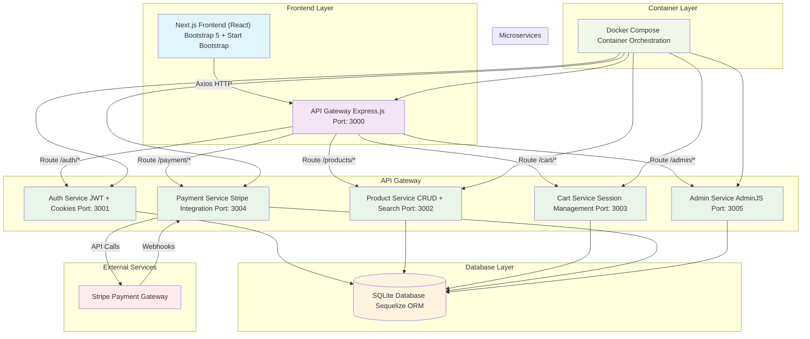
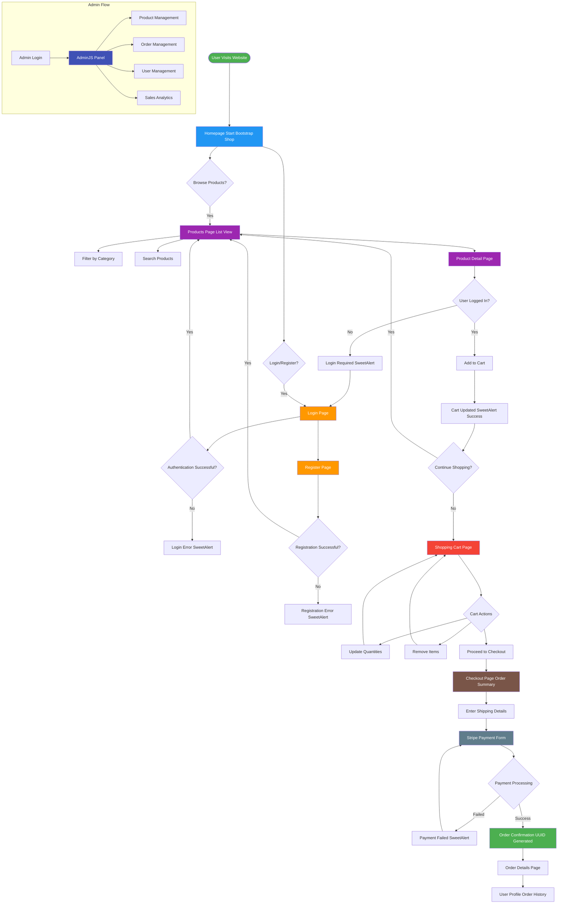
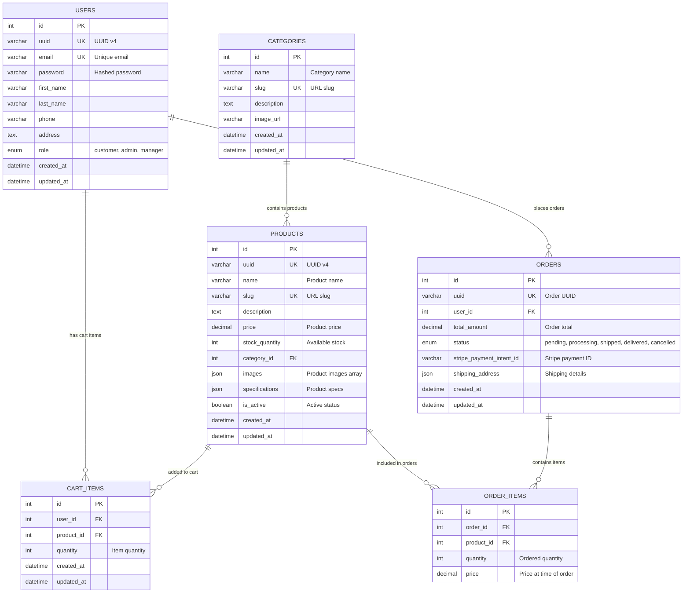

# Architecture and Design System

## System Architecture Diagrams

```mermaid
graph TB
    subgraph "Frontend Layer"
        UI["Next.js Frontend (React) Bootstrap 5 + Start Bootstrap"]
        UI --> |Axios HTTP| GW
    end
    
    subgraph "API Gateway"
        GW["API Gateway Express.js Port: 3000"]
        GW --> |Route /auth/*| AUTH
        GW --> |Route /products/*| PROD
        GW --> |Route /cart/*| CART
        GW --> |Route /payment/*| PAY
        GW --> |Route /admin/*| ADMIN
    end
    
    subgraph "Microservices"
        AUTH["Auth Service JWT + Cookies Port: 3001"]
        PROD["Product Service CRUD + Search Port: 3002"]
        CART["Cart Service Session Management Port: 3003"]
        PAY["Payment Service Stripe Integration Port: 3004"]
        ADMIN["Admin Service AdminJS Port: 3005"]
    end
    
    subgraph "Database Layer"
        DB[(SQLite Database Sequelize ORM)]
        AUTH --> DB
        PROD --> DB
        CART --> DB
        PAY --> DB
        ADMIN --> DB
    end
    
    subgraph "External Services"
        STRIPE["Stripe Payment Gateway"]
        PAY --> |API Calls| STRIPE
        STRIPE --> |Webhooks| PAY
    end
    
    subgraph "Container Layer"
        DOCKER["Docker Compose Container Orchestration"]
        DOCKER --> AUTH
        DOCKER --> PROD
        DOCKER --> CART
        DOCKER --> PAY
        DOCKER --> ADMIN
        DOCKER --> GW
    end
    
    style UI fill:#e1f5fe
    style GW fill:#f3e5f5
    style AUTH fill:#e8f5e8
    style PROD fill:#e8f5e8
    style CART fill:#e8f5e8
    style PAY fill:#e8f5e8
    style ADMIN fill:#e8f5e8
    style DB fill:#fff3e0
    style STRIPE fill:#ffebee
    style DOCKER fill:#f1f8e9
```

## User Flow Diagram

```mermaid
flowchart TD
    START([User Visits Website]) --> HOME[Homepage Start Bootstrap Shop]
    HOME --> BROWSE{Browse Products?}
    HOME --> LOGIN{Login/Register?}
    BROWSE -->|Yes| PRODUCTS[Products Page List View]
    PRODUCTS --> CATEGORY[Filter by Category]
    PRODUCTS --> SEARCH[Search Products]
    PRODUCTS --> DETAIL[Product Detail Page]
    DETAIL --> AUTH_CHECK{User Logged In?}
    AUTH_CHECK -->|No| LOGIN_PROMPT[Login Required SweetAlert]
    AUTH_CHECK -->|Yes| ADD_CART[Add to Cart]
    LOGIN_PROMPT --> LOGIN_PAGE[Login Page]
    LOGIN -->|Yes| LOGIN_PAGE
    LOGIN_PAGE --> AUTH_SUCCESS{Authentication Successful?}
    AUTH_SUCCESS -->|No| LOGIN_ERROR[Login Error SweetAlert]
    AUTH_SUCCESS -->|Yes| PRODUCTS
    LOGIN_PAGE --> REGISTER[Register Page]
    REGISTER --> REG_SUCCESS{Registration Successful?}
    REG_SUCCESS -->|No| REG_ERROR[Registration Error SweetAlert]
    REG_SUCCESS -->|Yes| PRODUCTS
    ADD_CART --> CART_UPDATE[Cart Updated SweetAlert Success]
    CART_UPDATE --> CONTINUE{Continue Shopping?}
    CONTINUE -->|Yes| PRODUCTS
    CONTINUE -->|No| CART_PAGE[Shopping Cart Page]
    CART_PAGE --> CART_ACTIONS{Cart Actions}
    CART_ACTIONS --> UPDATE_QTY[Update Quantities]
    CART_ACTIONS --> REMOVE_ITEM[Remove Items]
    CART_ACTIONS --> CHECKOUT[Proceed to Checkout]
    UPDATE_QTY --> CART_PAGE
    REMOVE_ITEM --> CART_PAGE
    CHECKOUT --> CHECKOUT_PAGE[Checkout Page Order Summary]
    CHECKOUT_PAGE --> SHIPPING[Enter Shipping Details]
    SHIPPING --> PAYMENT[Stripe Payment Form]
    PAYMENT --> PAYMENT_PROCESS{Payment Processing}
    PAYMENT_PROCESS -->|Failed| PAYMENT_ERROR[Payment Failed SweetAlert]
    PAYMENT_PROCESS -->|Success| ORDER_SUCCESS[Order Confirmation UUID Generated]
    PAYMENT_ERROR --> PAYMENT
    ORDER_SUCCESS --> ORDER_DETAILS[Order Details Page]
    ORDER_DETAILS --> PROFILE[User Profile Order History]
    subgraph "Admin Flow"
        ADMIN_LOGIN[Admin Login] --> ADMIN_PANEL[AdminJS Panel]
        ADMIN_PANEL --> PROD_MGMT[Product Management]
        ADMIN_PANEL --> ORDER_MGMT[Order Management]
        ADMIN_PANEL --> USER_MGMT[User Management]
        ADMIN_PANEL --> ANALYTICS[Sales Analytics]
    end
    style START fill:#4caf50,color:#fff
    style HOME fill:#2196f3,color:#fff
    style LOGIN_PAGE fill:#ff9800,color:#fff
    style REGISTER fill:#ff9800,color:#fff
    style PRODUCTS fill:#9c27b0,color:#fff
    style DETAIL fill:#9c27b0,color:#fff
    style CART_PAGE fill:#f44336,color:#fff
    style CHECKOUT_PAGE fill:#795548,color:#fff
    style PAYMENT fill:#607d8b,color:#fff
    style ORDER_SUCCESS fill:#4caf50,color:#fff
    style ADMIN_PANEL fill:#3f51b5,color:#fff
```

## Database Schema

```mermaid
erDiagram
    USERS {
        int id PK
        varchar uuid UK "UUID v4"
        varchar email UK "Unique email"
        varchar password "Hashed password"
        varchar first_name
        varchar last_name
        varchar phone
        text address
        enum role "customer, admin, manager"
        datetime created_at
        datetime updated_at
    }
    CATEGORIES {
        int id PK
        varchar name "Category name"
        varchar slug UK "URL slug"
        text description
        varchar image_url
        datetime created_at
        datetime updated_at
    }
    PRODUCTS {
        int id PK
        varchar uuid UK "UUID v4"
        varchar name "Product name"
        varchar slug UK "URL slug"
        text description
        decimal price "Product price"
        int stock_quantity "Available stock"
        int category_id FK
        json images "Product images array"
        json specifications "Product specs"
        boolean is_active "Active status"
        datetime created_at
        datetime updated_at
    }
    CART_ITEMS {
        int id PK
        int user_id FK
        int product_id FK
        int quantity "Item quantity"
        datetime created_at
        datetime updated_at
    }
    ORDERS {
        int id PK
        varchar uuid UK "Order UUID"
        int user_id FK
        decimal total_amount "Order total"
        enum status "pending, processing, shipped, delivered, cancelled"
        varchar stripe_payment_intent_id "Stripe payment ID"
        json shipping_address "Shipping details"
        datetime created_at
        datetime updated_at
    }
    ORDER_ITEMS {
        int id PK
        int order_id FK
        int product_id FK
        int quantity "Ordered quantity"
        decimal price "Price at time of order"
    }
    USERS ||--o{ CART_ITEMS : "has cart items"
    USERS ||--o{ ORDERS : "places orders"
    CATEGORIES ||--o{ PRODUCTS : "contains products"
    PRODUCTS ||--o{ CART_ITEMS : "added to cart"
    PRODUCTS ||--o{ ORDER_ITEMS : "included in orders"
    ORDERS ||--o{ ORDER_ITEMS : "contains items"
```
